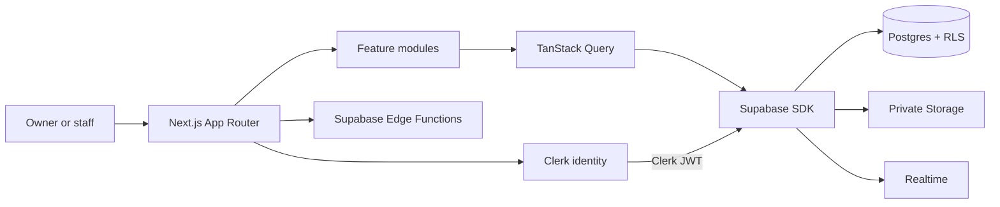

<div align="center">
  

  <h1>AquaFlow</h1>

  <p><strong>Operations software built around the daily work of water refilling stations.</strong></p>

  <p>
    Manage customers, recurring deliveries, products, stock, expenses, equipment maintenance,
    compliance documents, and business performance from one organization-scoped workspace.
  </p>

  [](https://github.com/destinyarx/water-station-web/actions/workflows/ci.yml)
  [](https://nextjs.org/)
  [](https://www.typescriptlang.org/)
  [](https://supabase.com/)
  [](https://clerk.com/)

  [Why AquaFlow](#why-aquaflow) · [Features](#features) · [Architecture](#architecture) · [Getting started](#getting-started) · [Contributing](#contributing)
</div>

---

## Why AquaFlow

Small water refilling businesses often coordinate orders, customer details, delivery routes, container stock, maintenance, receipts, and permits across paper logs and chat messages.

AquaFlow brings those operations into one system designed for the station owner and the staff doing the work each day.

It models the difference between a refill service and a stock-tracked product, between a recurring schedule and one delivery run, and between pausing a record and archiving it.

The goal is practical: fewer missed deliveries, clearer stock and maintenance signals, better compliance records, and a more reliable view of the business.

## Product overview

AquaFlow is a multi-tenant SaaS application. Each organization represents one water refilling station, and every protected business record is scoped to that station.

| Area | What it helps the business do | Status |
| --- | --- | :---: |
| Dashboard | Review delivery sales, expenses, refill volume, low stock, due maintenance, and today's delivery queue | Implemented |
| Customers | Maintain household and business customer profiles, service status, contact details, and addresses | Implemented |
| Deliveries | Create one-time or recurring schedules, prepare work, assign staff, track outcomes, and preserve history | Implemented |
| Products & stock | Manage bottled goods, containers, accessories, refill services, prices, availability, and stock adjustments | Implemented |
| Expenses | Record and summarize operating costs such as utilities, fuel, filters, supplies, repairs, and maintenance | Implemented |
| Maintenance | Schedule equipment upkeep, assign work, complete or cancel tasks, and retain maintenance history | Implemented |
| Documents | Store permits, certificates, receipts, test results, and other private business files with expiry metadata | Implemented |
| Notifications | Deliver personal, real-time operational notifications and maintain read state | Implemented |
| AquaFlow AI | Explore an owner-only conversational interface for business questions and structured insight cards | Prototype |
| Water quality | Track water-quality documents today; add dedicated test logging, parameters, results, and schedules | Planned |
| Sales, POS & payments | Extend completed-delivery revenue with walk-in sales, orders, payments, and receivables | Planned |

> [!NOTE]
> AquaFlow is under active development. Core operations are implemented, while the AI module currently uses mock responses and the dedicated water-quality and POS modules remain roadmap items.

## Features

### Role-aware operations dashboard

Owners receive financial and operational context, while staff receive only the operational information needed for daily work.

- View Today, Yesterday, This week, or This month.
- Compare completed-delivery sales with expenses.
- Review sales mix and top-performing products.
- Monitor completed deliveries and refill units.
- Surface today's queue, low-stock products, and maintenance due soon.
- Keep owner financial summaries out of staff sessions.

### Customer directory

Keep household and business customer records ready for scheduling and service.

- Store contact details and structured addresses.
- Distinguish business customers from households.
- Mark customers active or inactive without losing history.
- Archive records through soft delete when they should leave active lists.
- Restrict edits and archival actions according to owner and creator rules.

### Products, refill services, and stock

AquaFlow separates products the station counts from services that should not reduce physical inventory.

- Manage bottled water, gallons, caps, dispensers, accessories, fees, and refill services.
- Classify each entry as stock-tracked or non-stock-tracked.
- Adjust stock as a dedicated operational action.
- Mark an offering discontinued without removing historical references.
- Preserve product names, prices, and stock classification on delivery snapshots.

### Delivery scheduling and fulfillment

The delivery module models the plan and the real-world delivery occurrence as separate records.

- Create one-time, weekly, or monthly delivery schedules.
- Serve saved customers or one-off named recipients.
- Add multiple products or services with captured unit prices.
- Work from a current queue of overdue, due-today, and nearest-upcoming deliveries.
- Move deliveries through `pending`, `for_delivery`, `completed`, `failed`, or `cancelled`.
- Require a reason for failed and cancelled deliveries.
- Stop or resume recurring schedules without deleting completed history.
- Deduct stock while tracked products are out for delivery and restore it when work leaves that window.

### Expense tracking

Record costs in the same operational system that produces delivery revenue.

- Capture amount, date, category, payment method, description, and reference number.
- Support station-specific “Other” categories and payment methods.
- Summarize organization expenses without exposing another tenant's records.
- Allow owners to manage organization expenses and staff to manage permitted records.

### Preventive maintenance

Turn maintenance plans into dated work that station staff can act on.

- Schedule one-time, daily, or weekly equipment maintenance.
- Support multiple one-time dates and up to three selected weekdays.
- Assign tasks to real organization members or leave them unassigned.
- Prioritize and monitor overdue or upcoming work.
- Pause recurring schedules, complete tasks, cancel occurrences, and review history.
- Roll recurring work forward after an occurrence is completed or cancelled.

### Compliance document management

Keep operational and compliance files close to the records they support.

- Upload PDF, PNG, JPG, or WEBP files up to 10 MiB to private Supabase Storage.
- Organize permits, tax records, water-quality tests, sanitary records, receipts, and maintenance documents.
- Capture document date, amount, category, type, and optional expiry date.
- Share a document with all staff or keep it visible only to its creator and station owner.
- Let owners mark reviewed documents as approved.
- Open files through short-lived signed URLs.

### AquaFlow AI assistant

The owner-only assistant demonstrates how conversational business analysis can fit the same domain model.

- Keep each conversation private to its owner.
- Start with prompts for sales, stock, deliveries, maintenance, expenses, or customer activity.
- Render plain responses or structured insight, flag, and ranking cards.
- Persist conversation history with a bounded recent-message context window.
- Swap the local mock endpoint for a future hosted AI endpoint through configuration.

The current endpoint returns deterministic mock insights. It does not yet query live station data or call a production language model.

### Real-time notifications

Operational events can reach the relevant person without turning the notification feed into an organization-wide broadcast.

- Deliver per-user notifications through Supabase Realtime.
- Author notifications with trusted database triggers.
- Allow clients to consume notifications and update only their read state.
- Route known notification types to the relevant module.

## A typical station workflow

1. An owner creates a station, or a staff member joins it with an organization code.
2. The team records customers and configures stock-tracked products or non-stock-tracked services.
3. A user creates a one-time or recurring delivery schedule with item and price snapshots.
4. Staff work the current delivery queue and update each occurrence as it moves through fulfillment.
5. AquaFlow adjusts eligible stock, retains delivery history, and refreshes dashboard operations.
6. The owner records expenses and reviews completed-delivery performance against operating costs.
7. The team completes scheduled equipment upkeep and stores permits, receipts, certificates, and test documents.

## Roles and tenant isolation

| Capability | Owner | Staff |
| --- | :---: | :---: |
| View organization operations | Yes | Yes |
| View owner financial analytics | Yes | No |
| Manage customers and allowed operational records | Yes | Yes |
| Create products and adjust station stock | Yes | Yes |
| Manage records created by other staff | Yes | Limited |
| Work shared delivery and maintenance queues | Yes | Yes |
| Review and approve organization documents | Yes | Limited |
| Use AquaFlow AI | Yes | No |

Clerk provides identity and trusted session claims. Supabase Row Level Security remains the data boundary, so hiding an action in the interface is never the only authorization control.

## Architecture



Normal data flow follows one consistent path:

```text
UI → Zod validation → query or mutation hook → feature service → Supabase SDK → RLS → response
```

### Important engineering decisions

- **Feature-based modules:** business logic lives under `src/features`, while App Router pages stay thin.
- **Server-state ownership:** TanStack Query handles reads, mutations, caching, and targeted invalidation.
- **Validated boundaries:** React Hook Form and Zod validate forms; service responses are parsed before use.
- **Database authorization:** RLS independently enforces tenant and role boundaries for public tables.
- **Trusted ownership:** `org_id` and `created_by` come from the authenticated Clerk session, not form fields.
- **Historical accuracy:** delivery items retain price, name, and stock-classification snapshots.
- **Soft deletion:** records with `deleted_at` are archived and excluded from active views.
- **Spec-driven delivery:** behavior starts in `docs/specs` and is supported by requirements, acceptance criteria, plans, and ADRs.

## Technology stack

| Layer | Technology |
| --- | --- |
| Framework | Next.js 16 App Router, React 19 |
| Language | TypeScript 5 in strict mode |
| Authentication | Clerk |
| Database and backend | Supabase Postgres, Row Level Security, Storage, Realtime, Edge Functions |
| Server state | TanStack Query |
| Forms and validation | React Hook Form, Zod |
| Interface | Tailwind CSS 4, shadcn/ui, Radix UI, Lucide icons |
| Testing | Vitest |
| CI | GitHub Actions with Bun |

## Repository structure

```text
water-station-web/
├── .github/workflows/       # CI checks
├── docs/
│   ├── adr/                 # Architecture decision records
│   ├── specs/               # Feature PRDs, requirements, plans, and acceptance criteria
│   ├── ARCHITECTURE.md
│   ├── DATABASE.md
│   ├── DESIGN.md
│   ├── SECURITY.md
│   └── TESTING.md
├── public/                  # Static assets
├── src/
│   ├── app/                 # Routes, layouts, providers, and route handlers
│   ├── components/          # Shared app and UI components
│   ├── features/            # Domain feature modules
│   ├── hooks/               # Cross-feature hooks
│   └── lib/                 # Shared infrastructure and utilities
├── AGENTS.md                # Operating rules for coding agents
├── CONTEXT.md               # Product vocabulary and business rules
└── package.json
```

Database migrations are maintained in the companion [water-station-supabase](https://github.com/destinyarx/water-station-supabase) repository.

## Getting started

### Prerequisites

- [Bun](https://bun.sh/) 1.3 or a current Node.js installation
- A [Clerk](https://clerk.com/) application
- A [Supabase](https://supabase.com/) project
- The Supabase CLI for database setup

### 1. Clone and install

```bash
git clone https://github.com/destinyarx/water-station-web.git
cd water-station-web
bun install --frozen-lockfile
```

### 2. Configure environment variables

Create `.env.local` in the project root:

```bash
NEXT_PUBLIC_CLERK_PUBLISHABLE_KEY=your_clerk_publishable_key
CLERK_SECRET_KEY=your_clerk_secret_key

NEXT_PUBLIC_SUPABASE_URL=https://your-project.supabase.co
NEXT_PUBLIC_SUPABASE_PUBLISHABLE_KEY=your_supabase_publishable_key

NEXT_PUBLIC_SUPABASE_EDGE_CREATE_ORG_URL=https://your-project.supabase.co/functions/v1/create-aquaflow-organization
NEXT_PUBLIC_SUPABASE_EDGE_ADD_STAFF_URL=https://your-project.supabase.co/functions/v1/aquaflow-add-staff

# Optional. When omitted, AquaFlow AI uses the local mock route.
NEXT_PUBLIC_SUPABASE_EDGE_AQUAFLOW_AI_URL=
```

Never commit `.env.local`, Clerk secrets, database credentials, service-role keys, or webhook secrets.

### 3. Configure Clerk and Supabase

1. In Clerk, create a JWT template named `water-station`.
2. Expose the trusted top-level claims `organization`, `is_owner`, `name`, and `email` from Clerk user metadata.
3. Configure Supabase to accept the Clerk JWT used by the browser client.
4. Apply the canonical schema and RLS migrations from the companion backend repository.
5. Deploy the two onboarding Edge Functions referenced by the environment variables above.

The onboarding functions must create the station membership records and update Clerk `public_metadata` with the organization UUID and owner flag. See [CONTEXT.md](CONTEXT.md) for the identity contract.

To prepare the companion migration repository:

```bash
git clone https://github.com/destinyarx/water-station-supabase.git
cd water-station-supabase
bun install --frozen-lockfile
bun run supabase link --project-ref your-project-ref
bun run db:push
```

Review migrations before applying them to a shared or production database.

### 4. Start the application

```bash
bun run dev
```

Open [http://localhost:3000](http://localhost:3000), create an account, and complete owner or staff registration.

## Available commands

| Command | Purpose |
| --- | --- |
| `bun run dev` | Start the Next.js development server |
| `bun run build` | Create a production build |
| `bun run start` | Run the production server |
| `bun run lint` | Run ESLint |
| `bun run typecheck` | Run TypeScript without emitting files |
| `bun run test` | Run the Vitest suite once |

The equivalent `npm run ...` commands are also available.

## Security model

AquaFlow treats tenant isolation as a database responsibility supported by application-level guards.

- Every organization-owned record is scoped by `org_id`.
- `org_id` and `created_by` are resolved from the authenticated Clerk identity.
- Forms never ask users to submit tenant or creator identifiers.
- Public Supabase tables require Row Level Security policies.
- Owner and staff permissions are checked at both interface and database boundaries.
- Private documents use organization-aware Storage policies and short-lived signed URLs.
- Normal delete actions use `deleted_at` where the table supports archival.
- Mutations validate their inputs and surface safe user-facing errors.

Please report suspected vulnerabilities privately to the maintainer instead of opening a public issue with exploit details or sensitive data.

## Testing and quality

Before opening a pull request, run:

```bash
bun run lint
bun run typecheck
bun run test
bun run build
```

GitHub Actions runs install, lint, typecheck, and tests for repository changes. Manual verification is still required for Clerk claims, RLS isolation, cross-organization access, roles, and private document storage.

## Documentation

| Document | Purpose |
| --- | --- |
| [AGENTS.md](AGENTS.md) | Required workflow and guardrails for coding agents |
| [CONTEXT.md](CONTEXT.md) | Canonical product vocabulary and business rules |
| [Project constitution](docs/CONSTITUTION.md) | Non-negotiable engineering constraints |
| [Architecture](docs/ARCHITECTURE.md) | Routing, feature boundaries, and data flow |
| [Coding standards](docs/CODING_STANDARDS.md) | TypeScript and implementation conventions |
| [Security](docs/SECURITY.md) | Authentication, authorization, RLS, and secrets |
| [Database](docs/DATABASE.md) | Tables, policies, identity contract, and verification notes |
| [Design system](docs/DESIGN.md) | AquaFlow interface patterns and tokens |
| [Testing](docs/TESTING.md) | Automated and manual verification rules |
| [Feature specifications](docs/specs) | PRDs, research, requirements, acceptance criteria, and implementation records |

## Roadmap

- Dedicated water-quality monitoring with test schedules, measured parameters, results, and compliance status
- Walk-in sales, POS, orders, payment collection, invoices, and receivables
- Container pickup, return, deposit, and custody tracking
- A stock movement ledger and richer inventory controls
- Team management, station settings, and configurable permissions
- Expanded owner reports, exports, and forecasting
- Production AI integration grounded in authorized organization data
- Broader accessibility, responsive, integration, and end-to-end test coverage

Roadmap items describe direction, not committed release dates. New work should begin with an approved feature specification.

## Contributing

Contributions, bug reports, and domain feedback from water station owners, staff, developers, and designers are welcome.

1. Read [AGENTS.md](AGENTS.md) and the linked project rules.
2. Search existing [issues](https://github.com/destinyarx/water-station-web/issues) before proposing work.
3. For a feature, create or update its spec under `docs/specs/[nnn-feature-name]/`.
4. Keep changes small, typed, tested, and scoped to one business workflow.
5. Preserve tenant isolation, owner/staff permissions, validation, and soft-delete behavior.
6. Run the full quality checks and describe any required manual RLS verification.
7. Open a pull request that explains the business problem, technical approach, and verification evidence.

Good contributions use AquaFlow's domain language and improve a real water-station workflow instead of adding generic dashboard behavior.

## License

AquaFlow is available under the [MIT License](LICENSE).

## Project links

- [Web application repository](https://github.com/destinyarx/water-station-web)
- [Supabase migrations repository](https://github.com/destinyarx/water-station-supabase)
- [Issue tracker](https://github.com/destinyarx/water-station-web/issues)

---

<div align="center">
  Built for the people who keep clean water moving through their communities.
</div>
