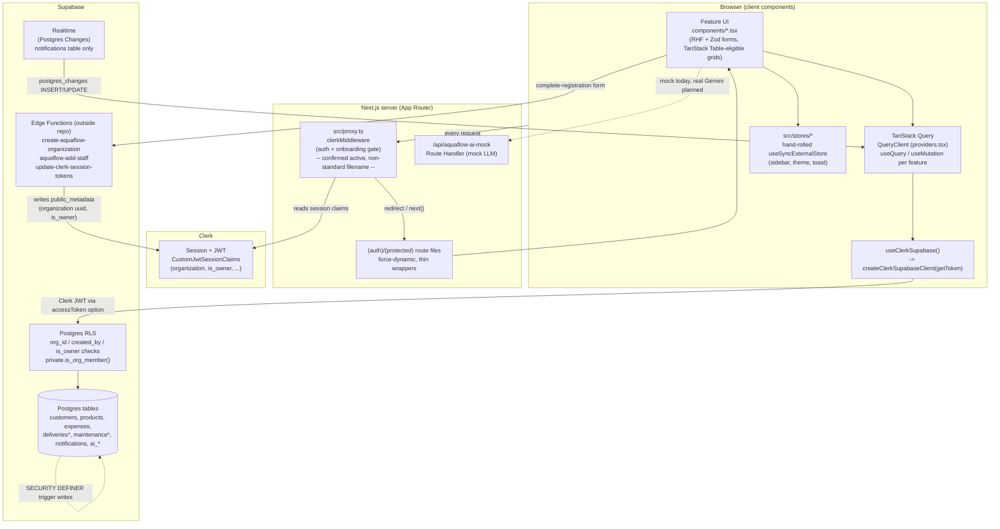

# Technical Architecture

Companion to [`05-codebase-map.md`](./05-codebase-map.md) (file locations) and
`07-data-architecture.md` / `04-feature-map.md` (referenced, not duplicated
here). This document describes *how the pieces fit together at runtime*.

## 1. Architecture style — **Confirmed**

A single Next.js application, client-heavy: nearly every protected page is a
`'use client'` component tree fetching data directly from Supabase via the
Supabase JS SDK, authorized by Row Level Security, with Clerk as the identity
provider. There is no separate backend service — Next.js Route Handlers exist
but are used for exactly one non-database purpose today (a mock AI reply
endpoint). This is a **feature-sliced monolith**: one Next.js app, business
logic organized into `src/features/<domain>` modules, each a vertical slice
(types → schema → mapper → service → hooks → components).

Evidence: `docs/ARCHITECTURE.md` (`UI -> validation -> hook/action -> feature
service -> Supabase SDK -> RLS -> response`), every `src/app/(protected)/*/page.tsx`
setting `export const dynamic = 'force-dynamic'` and rendering a
`'use client'` feature page.

**Potentially outdated / drift**: `docs/CODING_STANDARDS.md` prescribes
"Server Components by default... only use `'use client'` when the component
needs state/effects/etc." The actual shipped pattern is the opposite — every
protected route is force-dynamic and client-rendered end to end. This was
called out as a real architecture question in
`docs/improve-architecture/architecture-review.html` ("Good for 2026? Mostly
— it's all client-rendered `force-dynamic`; it ignores Server Components /
Server Actions"). Treat the *actual* pattern (client components + TanStack
Query) as the one to copy for new features unless the user says otherwise —
per `docs/CODING_STANDARDS.md`'s own rule to "follow existing patterns."

## 2. Frontend framework — **Confirmed**

Next.js 16 (App Router) + React 19, TypeScript strict mode
(`tsconfig.json`: `"strict": true`, no `any` allowed per `CLAUDE.md`/
`docs/CODING_STANDARDS.md`). Styling: Tailwind CSS v4 + shadcn/ui
(`components.json`, style `radix-vega`). Fonts via `next/font/google`
(Poppins). Dark mode is a `class` strategy toggled by a pre-paint inline
script in `src/app/layout.tsx` plus the hand-rolled `theme-store`
(see `05-codebase-map.md` §9).

## 3. Backend model — **Confirmed**

No custom backend server. "Backend" is Supabase (Postgres + RLS + Auth
integration + Realtime), reached directly from the browser via
`@supabase/supabase-js`. The only first-party server-side compute is:
- Clerk middleware (`src/proxy.ts`, auth gating — confirmed active via
  runtime evidence, see §7 and `05-codebase-map.md` §13),
- one Next.js Route Handler (`src/app/api/aquaflow-ai-mock/route.ts`, a mock),
- two Supabase Edge Functions living **outside this repo**
  (`create-aquaflow-organization`, `aquaflow-add-staff`, plus
  `update-clerk-session-tokens` referenced in ADR 0001) that write Clerk
  `public_metadata` during onboarding.

## 4. Rendering approach — **Confirmed**

Every protected route opts out of static rendering (`export const dynamic =
'force-dynamic'`) because customer/tenant data is per-session and
auth-dependent. Route files are Server Components by Next.js default, but
each one immediately renders a `'use client'` feature page component that
owns all data fetching client-side via TanStack Query. There is currently
**no use of Server Components for data fetching, and no Server Actions**
found anywhere in `src/` (**Confirmed** by the customers/products/expenses
patterns read in full). The landing page (`src/app/page.tsx`) is the one
route that could be statically rendered but its dynamic status is
**Unknown/Requires validation** (not explicitly set).

## 5. Client/server boundaries — **Confirmed**

- **Server-only**: `CLERK_SECRET_KEY` (never referenced in client code — not
  found in any `'use client'` file), Clerk middleware logic in `src/proxy.ts`.
- **Client (`'use client'`)**: essentially all feature `components/`, all
  `hooks/`, the Supabase client factory usage (`useClerkSupabase`), all
  TanStack Query/mutation code, all Zod form validation.
- **Isomorphic-safe**: `src/lib/supabase/client.ts`'s
  `createClerkSupabaseClient` guards against server-side Clerk `getToken()`
  calls (`typeof window === 'undefined'` check), because "Next.js can
  pre-render client components on the server" — so the factory itself is
  callable from either environment even though it's only actually exercised
  client-side today.

## 6. Data-fetching strategy — TanStack Query — **Confirmed**

`QueryClient` is instantiated once per app load in `src/app/providers.tsx`
(`staleTime: 60_000ms`, `refetchOnWindowFocus: false`). Every feature follows
the same shape (see `docs/improve-architecture/CODEBASE.md` §8, not
duplicated here): one `useQuery` read hook per list/detail, one `useMutation`
hook per write operation, query keys always arrays via a per-feature key
factory (`<feature>.keys.ts`), mutations invalidate the narrowest key that
covers what changed. **Known scaling gap** (**Confirmed**, still true):
list-read services (e.g. `getActiveCustomers`) take no filter/pagination
params — they fetch every non-deleted row per tenant and the page component
searches/filters/paginates client-side in a `useMemo`. Flagged as the top
production-readiness blocker in
`docs/improve-architecture/architecture-review.html`; do not copy this
specific gap into a brand-new module without calling it out.

## 7. State management split — **Confirmed**

| State category | Owner | Example |
|---|---|---|
| Server/remote data | TanStack Query | `useCustomers()`, `useAiConversations()` |
| Cross-page global UI state | Hand-rolled `useSyncExternalStore` stores in `src/stores/` (**not** Zustand — see below) | sidebar collapsed, theme, toast queue |
| Page-scoped UI state (search text, filters, dialog-open) | React `useState` inside the page/component | `customers-page.tsx` search/type/page state |
| Form state | React Hook Form (`useForm` + `zodResolver`) | `customer-form.tsx` |
| Pending-confirm values (two-step save) | `useSubmitConfirm<T>()` (`src/components/app/use-submit-confirm.ts`) | every `create/edit-<feature>-dialog.tsx` |

**Potentially outdated / drift, Confirmed by dependency check**:
`CLAUDE.md`/`docs/ARCHITECTURE.md`/`docs/CODING_STANDARDS.md` all specify
Zustand for this "global UI state" row. `zustand` is **absent from
`package.json`** (checked both `dependencies` and `devDependencies`). The
actual implementation is three files (`sidebar-store.ts`, `theme-store.ts`,
`toast-store.ts`) each a plain module-scope `let` + `Set` of listener
callbacks, exposed to React via `useSyncExternalStore`. Each file's own
comment says `// no external dep needed`. New global-UI-state needs should
follow this existing pattern, not introduce the zustand package without
first surfacing the mismatch to the user (`docs/AI-GUARDRAILS.md`: no new
dependencies without justification).

## 8. Caching strategy — **Confirmed**

Caching is entirely TanStack Query's in-memory cache (no Redis, no HTTP cache
headers customization found, no `revalidate`/ISR usage found — consistent
with blanket `force-dynamic`). Cache invalidation is manual and mutation-driven
(`queryClient.invalidateQueries({ queryKey: ... })` in `onSuccess`), not
tag-based (`revalidateTag`/`revalidatePath` are unused — **Confirmed**, no
occurrences found in `src/`). The realtime notifications feature is the one
place cache is patched **without** invalidation — it writes directly into the
query cache via `queryClient.setQueryData` from a Postgres Changes payload
(see §14).

## 9. Validation strategy — Zod — **Confirmed**

Two Zod schemas per entity, same file, by convention (`<feature>.schema.ts`):
a **row schema** validating whatever Supabase returns (defense against schema
drift — `.parse()` throws rather than letting malformed data reach the UI
silently) and a **form schema** driving both `zodResolver(...)` client
validation and the type contract handed to the mapper/service. All feature
types are inferred (`z.infer`/`z.input`/`z.output`), never hand-duplicated —
enforced by `CLAUDE.md` and cross-checked in the customers/products/expenses
modules read during this pass. Server-side validation for the one Route
Handler (`aquaflow-ai-mock`) is done with plain `typeof` narrowing, not Zod
(**Confirmed** by reading `route.ts` — the body is untyped JSON, narrowed
manually). This is a minor deviation from `docs/CODING_STANDARDS.md`'s "Route
handlers must validate incoming request data with Zod when used," worth
flagging if that endpoint is ever promoted past mock status.

## 10. Authentication — Clerk — **Confirmed**

Clerk (`@clerk/nextjs`) is the sole identity provider. `ClerkProvider` wraps
the app in `src/app/providers.tsx`. Auth pages: `src/app/(auth)/sign-in`,
`sign-up` (Clerk's prebuilt catch-all components, themed via
`auth-appearance.ts`). Session claims are typed globally in
`src/types/globals.d.ts` (`CustomJwtSessionClaims`: `organization` uuid,
`is_owner`, `name`, `email`, `organization_name`, `organization_role`).

Onboarding gate (`docs/adr/0001-onboarding-gating-via-clerk-claims.md`): a
user is "registered" iff `sessionClaims.organization != null &&
sessionClaims.is_owner != null` — one predicate,
`isRegistered()` in `src/features/registration/registration.guards.ts`,
reused by both `src/proxy.ts` middleware and client hooks. `src/proxy.ts` is
**confirmed active** as Next.js middleware despite its non-standard filename
— see `05-codebase-map.md` §13 for the runtime evidence.

## 11. Authorization — Owner/Staff roles — **Confirmed** (RLS) / **Inferred** (UI)

Two roles: Owner (`is_owner: true`) and Staff. Enforcement is layered:
1. **RLS** (authoritative, Postgres-level) — every organization-owned table's
   policies check `org_id = jwt.org` and, for owner-restricted actions,
   `is_owner`. This holds even if application code is bypassed.
2. **Route-level gating** (only one precedent so far) —
   `docs/adr/0008-owner-only-route-level-gating.md`: AquaFlow AI is the first
   whole-page, role-gated route (nav item hidden + route itself redirects
   non-owners + RLS backstop). Every earlier owner-only rule was a
   per-record ownership check inside a page every role could open (e.g. "can
   this user edit this specific product"), not a route-level block.
3. **Guard functions** (`<feature>.guards.ts`) — pure predicates like
   `canEditCustomer`. The architecture review
   (`docs/improve-architecture/architecture-review.html`, Candidate 5) flags
   that most feature modules only guard on `deleted_at`/ownership, not
   role — i.e., a Staff user may see UI affordances for actions RLS will
   ultimately reject. This is a documented **gap**, not a security hole (RLS
   still blocks the write), but it is a UX rough edge worth knowing about
   before assuming every guard file is role-aware.

## 12. Multi-tenancy — **Confirmed**

Tenant key: `organizations.id` (uuid), carried end-to-end as `org_id` on
every organization-owned table (`docs/adr/0009-org-id-is-organizations-uuid.md`).
The Clerk `organization` session claim carries this same uuid as a plain
string — used by the client as a convenience to *supply* `org_id` on writes,
but RLS independently re-validates via `private.is_org_member(org_id)`, so a
forged/stale claim cannot write cross-tenant. `created_by` is always the
Clerk user id (`sub`). Both values are resolved by a per-feature
`use-<feature>-owner.ts` hook (e.g. `use-customer-owner.ts`, read in full —
returns `null` if either value is missing, and the mutation hook throws
*before* calling the service in that case) — **never** taken from form
input, matching the hard rule in `CLAUDE.md`/`docs/CONSTITUTION.md`/
`docs/SECURITY.md`. Full table-by-table RLS policy inventory:
`docs/DATABASE.md` (referenced, not duplicated here — see also
`07-data-architecture.md`).

## 13. API architecture — **Confirmed**

There is effectively no first-party REST/RPC API surface for domain data —
domain reads/writes go straight through the Supabase SDK from the browser,
governed by RLS (`docs/ARCHITECTURE.md`'s explicit ban on `*.api.ts`
files/raw `fetch` for normal Supabase queries). The only Route Handler,
`POST /api/aquaflow-ai-mock`, exists because it stands in for a future
external LLM call (a genuine server-only concern), not because it wraps
Supabase.

## 14. Database access / real-time — Supabase SDK — **Confirmed**

- **Client construction**: `createClerkSupabaseClient(getToken)`
  (`src/lib/supabase/client.ts`) builds a `supabase-js` client whose
  `accessToken` option resolves to the current Clerk token
  (`getToken({ template: 'water-station' })`, requested via
  `useClerkSupabase()`). This is what lets Postgres RLS see `auth.jwt()`
  claims sourced from Clerk, not Supabase's own auth.
- **Realtime**: one feature (`notifications`) uses Supabase Realtime
  (Postgres Changes) — `useNotificationsRealtime()` subscribes to
  `INSERT`/`UPDATE` on `public.notifications` filtered
  `recipient_id=eq.<clerkId>`, and patches the TanStack Query cache directly
  via `queryClient.setQueryData` rather than invalidating + refetching. RLS
  is documented as the real per-connection security boundary; the filter is
  a bandwidth optimization only. Notifications are **insert-only via
  `SECURITY DEFINER` Postgres triggers** — there is deliberately no client
  INSERT path (`docs/adr/0010-notifications-trigger-authored-consume-only.md`).
  This is the only realtime feature found in the repo — **Confirmed**, no
  other `.channel(`/`postgres_changes` usage found outside `src/features/notifications`.

## 15. File storage — **Unknown / Requires validation**

No Supabase Storage bucket usage, no file-upload UI, and no storage client
calls were found in the files read during this pass. `src/features/documents`
exists as a route/feature (`/documents`) but its internal implementation was
not read in this pass — **Requires validation**: check
`src/features/documents/services/*` before assuming whether it stores actual
files (Supabase Storage) or just document metadata rows.

## 16. Background processing — **Confirmed: none**

No queues, cron jobs, or scheduled functions in this repo. What looks like
"recurrence" (deliveries, maintenance) is **client-triggered rolling
materialization** — a service function that runs synchronously when a user
loads the relevant page/list, generating due occurrences on demand, not a
server-side scheduled job. See
`docs/adr/0002-deliveries-two-entity-rolling-materialization.md` and
`docs/adr/0006-maintenance-roll-forward-occurrences.md`.

## 17. External integrations — **Confirmed** (mock) / **Inferred** (future)

- **Clerk** — auth (see §10).
- **Supabase** — Postgres + RLS + Realtime (see §12/§14) and two edge
  functions for onboarding (outside this repo).
- **AquaFlow AI** — currently a **mock** Next.js Route Handler
  (`aquaflow-ai-mock/route.ts`) returning keyword-matched canned replies. Its
  own code comment states it mirrors "the same contract a real Gemini-backed
  Supabase Edge Function will use" — so a Google Gemini integration is
  **planned but not implemented** (**Inferred** from the comment and
  `docs/specs/011-aquaflow-ai-feature/`, not confirmed as built).
- No payment processor, email/SMS provider, or other third-party SaaS
  integration was found in dependencies or code.

## 18. Error handling — **Confirmed**

Service functions never let raw Postgres/Supabase error objects reach the UI:
on `{ error }`, they throw a generic `Error` built from a constant string in
`<feature>.constants.ts` (e.g. `CUSTOMERS_LOAD_ERROR`). Mutation hooks surface
`error.message` to the user via the shared toast store
(`toast.error(error.message)`), never a raw stack trace. This matches
`docs/SECURITY.md` ("do not expose internal errors to users") and
`docs/CODING_STANDARDS.md`'s good/bad error message examples.

## 19. Logging / analytics — **Confirmed: none**

No logging library, error-tracking SDK (Sentry et al.), or analytics/telemetry
SDK (PostHog, Amplitude, Mixpanel, etc.) found anywhere in `package.json` or
`src/`. The only logging observed is a `console.log('[Middleware Log]', ...)`
call inside `src/proxy.ts` for local debugging of the auth gate. Adding any
observability tooling would be a new dependency requiring explicit
justification/approval per `docs/AI-GUARDRAILS.md`.

## 20. Deployment architecture — **Unknown / Inferred**

No `vercel.json`, Dockerfile, or CI workflow files exist in the repo. The only
signal of an intended deployment target is a `.vercel` entry in `.gitignore`,
which is consistent with (but does not confirm) a Vercel git-integration
deployment of this Next.js app. `next.config.ts` contains no deployment-related
config (just `turbopack.root`). **Requires validation** with the user before
making any deployment-specific assumptions or changes.

## 21. Environment separation — **Unknown / Requires validation**

A single `.env` file exists at repo root (git-ignored). No `.env.example`,
`.env.local`, `.env.production`, or similar were found, so there is no
in-repo evidence of how dev/staging/production environments are separated
(e.g. distinct Supabase projects, distinct Clerk instances). Do not assume a
particular environment topology without asking.

## 22. Testing architecture — **Confirmed**

Vitest (`vitest.config.ts`, node environment). Per `docs/TESTING.md`, feature
tests live in `src/features/<feature>/tests/` and should cover: Zod schema
edge cases, mapper behavior, query key factory shape, guard predicates,
service behavior against a **hand-mocked chained Supabase client** (each
chain method a `vi.fn()` returning the next link, terminating in
`Promise.resolve({ data, error })` — no real network calls), and mutation
invalidation behavior. RLS tenant isolation, cross-org access attempts, and
owner/staff differences are explicitly **manual verification**, not automated
(`docs/TESTING.md` §Manual Verification; `docs/DATABASE.md` documents the
manual RLS checklist per table). See `05-codebase-map.md` §16 for which
features currently have/lack a `tests/` folder.

---

## Architecture diagram

## Request lifecycle — worked example (create a customer)

Grounded in the actual files read for this pass; see also
`docs/improve-architecture/CODEBASE.md` §11–12 for the equivalent read-path
walkthrough (not duplicated here).

1. **User action**: user clicks "Add customer" on `/customers`
   (`src/app/(protected)/customers/page.tsx` → `CustomersPage`), fills the
   form rendered by `src/features/customers/components/customer-form.tsx`,
   clicks submit.
2. **Client validation**: `customer-form.tsx` uses `useForm` +
   `zodResolver(customerFormSchema)` (`src/features/customers/customers.schema.ts`).
   `handleSubmit` only calls `onSubmit(values)` if the Zod schema passes.
3. **Confirm step**: `create-customer-dialog.tsx` wires `onSubmit` to
   `confirm.request` (`useSubmitConfirm<CustomerFormValues>()` —
   `src/components/app/use-submit-confirm.ts`), which stashes the validated
   values and opens `SaveConfirmDialog`. User clicks "Confirm."
4. **Mutation dispatch**: `runMutation()` calls
   `mutation.mutate(confirm.pending)`, where `mutation` is
   `useCreateCustomer()` (`src/features/customers/hooks/use-create-customer.ts`).
5. **Authorization context resolution**: inside the mutation's `mutationFn`,
   `useCustomerOwner()` (`src/features/customers/hooks/use-customer-owner.ts`)
   has already read `useAuth()` and returned `{ orgId, createdBy }` from the
   Clerk session claims (`sessionClaims.organization`, `userId`). If either
   is missing, the mutation throws *before any network call*
   ("Your station context is missing...") — this is a client-side UX guard,
   not the security boundary.
6. **Network request**: `createCustomer(client, values, owner)`
   (`src/features/customers/services/customers.service.ts`) maps `values` +
   `owner` to a snake_case insert payload via `toInsertRow` (`customers.mapper.ts`,
   `org_id`/`created_by` taken **only** from `owner`, never from `values`),
   then calls `client.from('customers').insert(...).select(CUSTOMER_COLUMNS).single()`.
   `client` is the memoized `useClerkSupabase()` instance, so the request
   carries the current Clerk JWT as `auth.jwt()`.
7. **Authorization (server-side)**: Postgres RLS's INSERT policy on
   `public.customers` independently re-checks `org_id = jwt.org` and
   `created_by = jwt.sub` (`docs/DATABASE.md` → `public.customers` →
   Policies). A forged/stale client-side `owner` value cannot bypass this.
8. **Persistence**: row is inserted; Postgres returns the new row (via
   `.select(...).single()`).
9. **Response validation**: the service parses the returned row through
   `customerRowSchema.parse(data)`, then maps it to the display model via
   `toCustomer()`. On any Supabase `{ error }`, the service throws the
   generic `CUSTOMER_SAVE_ERROR` constant instead of the raw Postgres error.
10. **Cache invalidation**: on mutation success,
    `queryClient.invalidateQueries({ queryKey: customerKeys.lists() })` runs,
    and `toast.success('Customer added.')` fires from inside the hook (not
    the component).
11. **UI update**: `CustomersPage`'s `useCustomers()` query (subscribed to
    `customerKeys.list(...)`) refetches automatically due to the
    invalidation; the dialog closes (`dialog.onOpenChange(false)` in the
    mutation's `onSuccess` callback inside `create-customer-dialog.tsx`); the
    new customer appears in the list without a full page reload.

On error at any Supabase step: the mutation's `onError` handler calls
`toast.error(error.message)` with the safe constant message; the confirm
dialog surfaces `dialog.errorMessage`; the form/dialog stays open so the user
can retry.

## Unresolved architecture questions (for aggregation, not answered here)

- ~~Is `src/proxy.ts` actually active as Next.js middleware?~~ **Resolved**:
  yes, confirmed via runtime log evidence — see
  [`03-specification-status.md`](03-specification-status.md) row 1.
- What is the actual deployment target/pipeline (Vercel inferred only from
  `.gitignore`)? No CI, no IaC, no explicit config found.
- How are dev/staging/production environments separated (single `.env`
  found, no example/environment-specific files)?
- Is `src/features/documents` backed by Supabase Storage or just metadata
  rows — file storage strategy is unconfirmed.
- Should the Zustand-in-docs vs. hand-rolled-store-in-code mismatch be
  resolved by adding the dependency or by amending the docs?
- Should the "fetch all rows, paginate client-side" pattern in list services
  be treated as tech debt to fix opportunistically, or an accepted trade-off
  for current scale?
- Is the AquaFlow AI Gemini backend actually planned/in-progress, or purely
  aspirational from a code comment?
