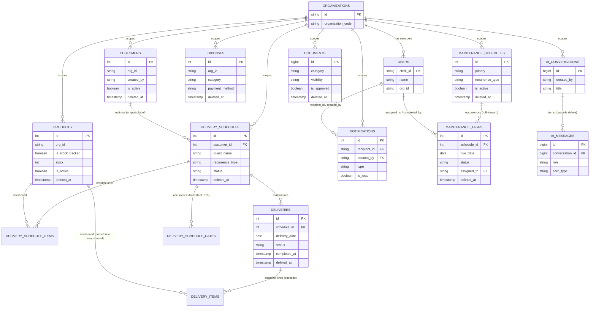

# Data Architecture — Supabase/Postgres Schema

> Written for AI coding agents picking up this repo cold. Labels on every
> non-trivial claim: **Confirmed** (directly stated in a spec/doc/code),
> **Inferred** (reasonably derived but not stated outright), **Unknown**
> (no evidence found), **Potentially outdated** (spec/doc text contradicted
> by later docs/code), **Requires validation** (should be checked against
> the live Supabase project before being relied on).
>
> Primary sources: `docs/DATABASE.md` (canonical policy documentation per
> `docs/SECURITY.md`), the `docs/adr/*.md` decision records, and the `.sql`/
> `.md` migration files inside `docs/specs/*`. This file summarizes and
> cross-checks those; it does not replace `docs/DATABASE.md` as the
> authoritative RLS reference — see that file for full policy text before
> changing any policy.
>
> See [01-product-overview.md](./01-product-overview.md) for product context
> and [08-api-and-integrations.md](./08-api-and-integrations.md) for how
> these tables are reached from the app and from external services.

## 1. Technology — **Confirmed**

- **Database**: Supabase-hosted Postgres. `docs/ARCHITECTURE.md` ("Core
  Stack" — "Supabase for database, storage, and backend services").
- **Client access**: `@supabase/supabase-js` browser client only — no
  server-side Supabase admin client or service-role usage was found anywhere
  in `src/`. Evidence: `src/lib/supabase/client.ts` (`createClerkSupabaseClient`,
  built with the publishable/anon key), `docs/SECURITY.md` ("Never use the
  service role key in browser code").
- **Auth vs. authorization split**: Clerk issues identity/session; Supabase
  Row Level Security (RLS) is the sole authorization boundary for tenant
  isolation and role gating. Evidence: `docs/ARCHITECTURE.md` ("Auth Flow"),
  `docs/DATABASE.md` (every table section).
- **No ORM.** All access is the Supabase JS query builder / PostgREST,
  called from `src/features/*/services/*.service.ts`. **Confirmed** —
  Evidence: `docs/CODING_STANDARDS.md`/`docs/ARCHITECTURE.md` ("Do not create
  `*.api.ts` files or raw `fetch('/api/...')` ... Use the Supabase SDK inside
  feature services").

## 2. Migration Strategy — **Confirmed**

There is **no `supabase/` directory and no migration tooling** (no Supabase
CLI migrations folder, no Prisma/Drizzle schema) in this repo.

```
$ find . -iname "*.sql" (excluding node_modules)
docs/specs/007-remap-ui-products-customers/007-status-columns.sql
docs/specs/009-build-documents-module/documents_table_migration.sql
docs/specs/010-rebuild-ui-ux-deliveries-module/delivery-rebuild-migration.sql
docs/specs/011-aquaflow-ai-feature/011-aquaflow-ai-schema.sql
docs/specs/013-realtime-notifications-features/013-notifications.sql
```

Additional migrations are written as fenced SQL inside Markdown, not `.sql`
files, e.g. `docs/specs/004-deliveries-module/004-deliveries-schema.md` and
`docs/specs/008-build-maintenance-module/maintenance_migration.md`.

Workflow actually used by this project (**Confirmed**, stated explicitly in
several of the files above and in `docs/ai-handoff/01-product-overview.md`):

1. A feature spec folder (`docs/specs/NNN-feature-name/`) contains a `.sql`
   or `.md` file with the schema/RLS changes for that feature.
2. A human runs that SQL **manually in the Supabase Studio SQL editor**
   against the live project. There is no automated apply step, no CI
   migration runner, and no rollback tooling.
3. `docs/DATABASE.md` is updated by hand afterward to document the resulting
   tables/policies (required by `docs/SECURITY.md`: "Every policy must be
   documented in `docs/DATABASE.md`").
4. The committed SQL file is the audit trail of *what was intended to run*,
   not a guaranteed live-state mirror — some files explicitly warn about
   this (e.g. `docs/specs/010-rebuild-ui-ux-deliveries-module/delivery-rebuild-migration.sql`:
   "Apply after reviewing against the current database because this
   repository stores feature migrations under docs/specs rather than a
   Supabase migrations directory").

**Practical consequence for agents**: treat every `docs/specs/*/*.sql`
and `*_migration.md` file as a **historical, possibly-stale snapshot**, not
a live schema dump. Cross-check any column/type/policy claim against (a) the
Zod row schemas in `src/features/*/*.schema.ts` (which validate real
PostgREST responses and will fail loudly at runtime if wrong) and (b)
`docs/DATABASE.md`, and where those disagree, verify directly in the
Supabase dashboard before changing anything. See §5 for a concrete case
where this already happened.

## 3. Table Inventory

| Table | Feature / spec | PK | Soft delete | Notes |
|---|---|---|---|---|
| `public.organizations` | 000-auth_workflow | `id` (uuid, per ADR 0009) | no `deleted_at` seen | Tenant root. `organization_code` is the human-facing join code (**Confirmed**, `docs/adr/0009-org-id-is-organizations-uuid.md`, `CONTEXT.md`). Early ADR 003 draft shows `id uuid`, `name`, `code`, `created_by`, `created_at` — **Inferred** as a draft/earlier shape, not necessarily the exact live columns (**Requires validation**). |
| `public.organization_members` | 000-auth_workflow | Unknown | Unknown | Referenced only in ADR 003's draft schema and in `CONTEXT.md` ("creates the `organizations`, `organization_members`, and `users` rows for the owner"). No column list found in this repo. **Unknown** — **Requires validation**. |
| `public.users` | 000-auth_workflow (cross-cutting) | `clerk_id` (varchar/text, PK-like; referenced as FK target everywhere) | Unknown | Mirrors Clerk users; must have `org_id` scoping members to their org (used by the maintenance assignee picker's `users_select_org_members` policy). Confirmed columns actually referenced in code: `clerk_id`, `name`, `org_id`. Evidence: `src/features/maintenance/maintenance.schema.ts` (`orgUserRowSchema`), `docs/DATABASE.md` ("Assignee picker prerequisite"). |
| `public.customers` | 001-customers-basic-feature | `id` serial | `deleted_at` | Refill customers; `is_active` distinct from archive (ADR 0005). Full column list in `docs/DATABASE.md`. |
| `public.products` | 002-products | `id` serial | `deleted_at` | Stock-tracked vs. non-stock-tracked catalog (`is_stock_tracked`); `is_active` = discontinued flag. |
| `public.expenses` | 003-expenses | `id` (number, likely serial) | `deleted_at` (nullable, present on `Expense` display type) | Columns confirmed from code (not fully written up in `docs/DATABASE.md`, which only stubs this table — see §5): `name`, `amount`, `category`, `category_other`, `payment_method`, `payment_method_other`, `description`, `date_incurred`, `references_number`, `org_id`, `created_by`, `created_at`, `updated_at`, `deleted_at`. Evidence: `src/features/expenses/expenses.schema.ts`, `expenses.types.ts`. |
| `public.delivery_schedules` | 004-deliveries-module, 010-rebuild | `id` serial | `deleted_at` | The recurrence plan. `assigned_to` added in feature 010. |
| `public.delivery_schedule_items` | 004-deliveries-module | `id` serial | none (follows parent) | Template product lines. |
| `public.deliveries` | 004-deliveries-module, 005-continuation, 010-rebuild | `id` serial | `deleted_at` | Dated occurrence; `completed_at` (005), `assigned_to`/`cancellation_remarks` (010), `notes` column also referenced by the `v_current_deliveries` view. |
| `public.delivery_items` | 004-deliveries-module | `id` serial | none (follows parent) | Per-occurrence price/name snapshot. |
| `public.delivery_schedule_dates` | 010-rebuild-ui-ux-deliveries-module | `id` bigserial | none | New in feature 010; `(schedule_id, delivery_date)` unique. **Note**: its RLS (in the 010 migration file) is written against a `public.users` join (`org_id in (select users.org_id from public.users where users.clerk_id = (select auth.uid())::text)`) and uses `auth.uid()`, **not** the `auth.jwt() ->> 'sub'` / claims pattern every other table in this repo uses. This is a different identity pattern from the rest of the schema — **Requires validation** (confirm whether this table/policy was actually applied, and whether `auth.uid()` resolves correctly under the Clerk-forwarded-JWT setup used everywhere else). |
| `public.maintenance_schedules` | 008-build-maintenance-module | `id` (serial, inferred) | `deleted_at` | `is_active` distinct from archive; weekly CHECK on `times_per_week`. |
| `public.maintenance_tasks` | 008-build-maintenance-module | `id` (serial, inferred) | `deleted_at` | `assigned_to` FK → `users(clerk_id)`; unique `(schedule_id, due_date) where deleted_at is null`. |
| `public.documents` | 009-build-documents-module | `id` bigint identity | `deleted_at` | Metadata-only; **no file storage wired** (no bucket/path column) — building on an assumed retrievable file is building on a gap. See `docs/ai-handoff/01-product-overview.md` ("Known Constraints"). |
| `public.ai_conversations` | 011-aquaflow-ai-feature | `id` bigint identity | **none** — hard delete, cascades to messages | Personal-per-user, owner-only (ADR 0007, 0008). |
| `public.ai_messages` | 011-aquaflow-ai-feature | `id` bigint identity | **none** — hard delete via parent cascade | No denormalized `org_id`/`created_by`; ownership inherited via `conversation_id` FK + `exists` subquery in RLS. |
| `public.notifications` | 013-realtime-notifications-features | `id` serial | **none** (no dismissal in v1) | Trigger-authored only (`SECURITY DEFINER`); client cannot INSERT; UPDATE is column-locked to `is_read` via `GRANT`, not a policy. In the `supabase_realtime` publication. |
| `public.v_current_deliveries` | 005-deliveries-module-continuation | n/a (view) | n/a | `security_invoker = on` view over `deliveries`/`delivery_schedules`/`customers`; encapsulates the "current queue" selection rule (overdue/due-today + each schedule's next-upcoming row) so base-table RLS still applies to the caller. |

Tables explicitly **stubbed/incomplete** in `docs/DATABASE.md` itself:
`public.expenses` — the file states columns/RLS "must be kept synchronized ...
before changing expense persistence behavior" but only lists requirements,
not the actual current policy text. Treat expenses RLS policy details as
**Unknown / Requires validation** even though the column shape is
recoverable from code (table above).

## 4. Relationship Summary — **Confirmed** (from FKs stated in migration files and types)

- `organizations (1) ─── (N) *` every tenant-owned table via `org_id`.
- `users.clerk_id` is the FK target for every `created_by` column
  (customers, products, expenses, deliveries*, maintenance*, documents,
  ai_conversations, notifications-as-`created_by`), and for
  `delivered_by` (`deliveries`), `assigned_to` (`delivery_schedules`,
  `deliveries`, `maintenance_tasks`), `completed_by` (`maintenance_tasks`),
  `recipient_id` (`notifications`).
- `customers (1) ─── (N) delivery_schedules` via `customer_id` (nullable —
  a schedule is either linked to a customer **or** carries a guest label,
  enforced by a CHECK constraint, never both/neither).
- `delivery_schedules (1) ─── (N) deliveries` (materialized occurrences),
  `(1) ─── (N) delivery_schedule_items` (template lines), and
  `(1) ─── (N) delivery_schedule_dates` (feature 010 addition).
- `deliveries (1) ─── (N) delivery_items` (`on delete cascade`).
- `products (1) ─── (N) delivery_schedule_items` / `delivery_items` via
  `product_id` (delivery items also snapshot `product_name`/`unit_price` so
  this FK is historical lineage only, not a live-value dependency).
- `maintenance_schedules (1) ─── (N) maintenance_tasks` via `schedule_id`.
- `ai_conversations (1) ─── (N) ai_messages` via `conversation_id`
  (`on delete cascade` — the only cascade-hard-delete relationship in the
  schema; every other parent/child pair is soft-delete-independent).

## 5. High-Risk / Inconsistent Areas — **Requires validation before any schema change**

### 5.1 `org_id` type drift (integer vs. uuid) — the single biggest risk

`docs/adr/0009-org-id-is-organizations-uuid.md` (dated after ADR 0002/0005/
0006/0007/0008) states the schema **was migrated** so every tenant table
scopes by `org_id uuid references organizations(id)`, replacing an earlier
`org_id integer references organizations(organization_code)` scheme, because
`Number(uuid)` broke create hooks.

But the **migration files sitting in `docs/specs/`** for customers/products
(implied by `004-deliveries-schema.md`'s stated conventions),
deliveries (`004-deliveries-schema.md`), maintenance
(`maintenance_migration.md`), documents (`documents_table_migration.sql`),
and AquaFlow AI (`011-aquaflow-ai-schema.sql`) **all still show**:

```sql
org_id integer not null references public.organizations(organization_code)
```

while the notifications migration (`013-notifications.sql`, the newest
feature) and every current TypeScript Zod row schema in the codebase use:

```ts
org_id: z.string().uuid()
```

**Confirmed** (not just inferred) that the *live* database has moved to
uuid, at least for the tables actually exercised by the running app: **every**
`*.schema.ts` file across customers, products, expenses, deliveries,
maintenance, documents, and aquaflow-ai validates `org_id` as
`z.string().uuid()` against real Supabase query results — a mismatch would
throw at runtime on every list load, which the app evidently does not do in
normal operation. Evidence (grep):

```
src/features/customers/customers.schema.ts:   org_id: z.string().uuid()
src/features/products/products.schema.ts:      org_id: z.string().uuid()
src/features/expenses/expenses.schema.ts:       org_id: z.string().uuid()
src/features/deliveries/deliveries.schema.ts:   org_id: z.string().uuid() (x4)
src/features/maintenance/maintenance.schema.ts: org_id: z.string().uuid() (x2)
src/features/documents/documents.schema.ts:     org_id: z.string().uuid()
src/features/aquaflow-ai/aquaflow-ai.schema.ts: org_id: z.string().uuid()
```

**Conclusion**: the `docs/specs/*` SQL/`.md` files for customers, products,
deliveries, maintenance, documents, and AquaFlow AI are **Potentially
outdated** — they document the pre-ADR-0009 integer scheme and were not
retroactively rewritten after the uuid migration ran. `docs/DATABASE.md`
inherits the same staleness (its `public.customers`/`public.products`
sections still say `org_id integer (fk) → organizations(organization_code)`).
Do not use those files as a type reference for `org_id`; use the Zod schemas
or query the live `information_schema.columns` instead.

**What is still genuinely unresolved (Requires validation, not just stale
docs):**
- Whether the RLS policy *expressions* themselves were updated to compare
  against a uuid (e.g. `(auth.jwt() ->> 'organization')::uuid` instead of
  `::integer`) everywhere, or whether some policies still cast to
  `::integer` and are silently broken/permissive. The committed SQL casts to
  `::int`/`::integer` in every one of the stale files above; if those exact
  strings are still live, every RLS check on those tables would currently
  **fail to compile/match** against a uuid claim, which would mean the app
  simply couldn't read/write those tables at all — contradicting the
  product being "actively developed" per recent commits. This tension is
  not resolved by any document found in this repo. Treat the actual live
  policy text as unknown until read from the Supabase dashboard.
- Whether `organizations.organization_code` still exists as a separate
  human-facing join code column alongside the uuid `id` (this is consistent
  with CONTEXT.md's description of staff joining "by organization code") or
  whether it was dropped.
- `public.delivery_schedule_dates` (feature 010) additionally uses
  `org_id bigint references organizations(id)` — a **third** type/target
  variant (bigint, not integer or uuid) in the same repository, and its RLS
  policy resolves org via a `public.users` table join keyed on
  `auth.uid()`, not the `auth.jwt()` claims pattern every other table uses.
  This table/policy pairing needs direct verification against the live
  schema before anyone builds on it.

### 5.2 Legacy hard-delete policies

`docs/DATABASE.md` flags a legacy DELETE policy on `public.customers`
("Users can delete own customers in their organization") as a hard-delete
path that "must not be used by normal UI flows." **Confirmed** this policy
exists per the doc; whether it has been revoked elsewhere is unknown.
Any agent adding delete functionality must soft-delete via `deleted_at`
(`docs/SECURITY.md`) and must not wire UI to this legacy policy.

### 5.3 Two tables with no soft delete at all

`ai_conversations`/`ai_messages` (hard delete, cascading) and
`notifications` (no delete path exposed to the client at all — v1 has no
dismissal) are deliberate exceptions to the soft-delete-everywhere pattern.
**Confirmed** — `docs/DATABASE.md`, ADR 0007. Do not add `deleted_at` to
these without a new spec; their absence is a design decision, not an
oversight.

### 5.4 Documents module has no storage backend

`public.documents` stores metadata (`title`, `category`, `document_type`,
dates, `amount`) but there is no bucket/file-path column and no Supabase
Storage integration wired. **Confirmed** — `src/features/documents/components/upload-document-dialog.tsx`
(ponytail comment noting the file is a client-side object URL only),
`docs/ai-handoff/01-product-overview.md`. Any feature that assumes a
retrievable document file is building on a gap.

### 5.5 `ADR 0003` reference resolves to a spec-local file, not `docs/adr/`

`docs/DATABASE.md` and `CONTEXT.md` both cite "ADR 0003" for the
delivery stock-deduction/revert behavior, but there is no
`docs/adr/0003-*.md` (the `docs/adr/` folder's "003" slot is
`0003-organizations-schema-structure.md`, an unrelated topic, and there are
also **two** files both numbered `0009` — `0009-org-id-is-organizations-uuid.md`
and `0014-legal-consent-via-clerk.md` (renumbered by the fable review).
The actual stock/revert ADR lives at
`docs/specs/005-deliveries-module-continuation/adr-0003-delivery-status-stock-and-revert.md`
(a spec-local ADR, separate numbering series from `docs/adr/`). **Confirmed**
via `docs/ai-handoff/01-product-overview.md` evidence trail. Agents should
not assume "ADR 000N" always means a file in `docs/adr/`.

## 6. Table-to-Feature Mapping

| Feature module (`src/features/*`) | Primary table(s) | Spec folder |
|---|---|---|
| `customers` | `customers` | `001-customers-basic-feature` |
| `products` | `products` | `002-products` |
| `expenses` | `expenses` | `003-expenses` |
| `deliveries` | `delivery_schedules`, `delivery_schedule_items`, `deliveries`, `delivery_items`, `delivery_schedule_dates`, `v_current_deliveries` (view) | `004-deliveries-module`, `005-deliveries-module-continuation`, `010-rebuild-ui-ux-deliveries-module` |
| `maintenance` | `maintenance_schedules`, `maintenance_tasks` | `008-build-maintenance-module` |
| `documents` | `documents` | `009-build-documents-module` |
| `aquaflow-ai` | `ai_conversations`, `ai_messages` | `011-aquaflow-ai-feature` |
| `notifications` | `notifications` | `013-realtime-notifications-features` |
| `registration` | `organizations`, `organization_members`, `users` (written by Supabase Edge Functions, not by this feature's own service layer) | `000-auth_workflow` |
| `legal` / `landing` | none (Clerk-hosted legal consent, static content) | `012-privacy-policy-and-terms-condition`, `000-design` |
| `playground` | none (invokes `aquaflow-welcome-email` Edge Function only) | n/a — dev/demo feature, see [08-api-and-integrations.md](./08-api-and-integrations.md) |

## 7. Enums (Postgres native `create type ... as enum`) — **Confirmed** (from migration files)

| Enum | Values | Table |
|---|---|---|
| `delivery_recurrence_type` | `one_time`, `weekly`, `monthly`, `custom_dates` (added in feature 010) | `delivery_schedules.recurrence_type` |
| `delivery_schedule_status` | `active`, `paused`, `ended` | `delivery_schedules.status` |
| `delivery_status` | `pending`, `for_delivery`, `completed`, `failed`, `cancelled` (added in feature 010) | `deliveries.status` |

Other "enum-like" fields are plain `text`/`varchar` with a CHECK constraint
or app-level Zod enum, **not** Postgres enums (deliberately, to avoid a
migration per new value): `maintenance_schedules.priority`/`recurrence_type`,
`maintenance_tasks.status`, `documents.category`/`visibility`,
`ai_messages.role`/`card_type`, `notifications.type` (explicitly free
`varchar`, see ADR 0010 — "not a DB enum, so new modules add notification
kinds with no migration").

## 8. Constraints Worth Knowing — **Confirmed**

- `delivery_schedules`: exactly one of `customer_id`/`guest_name`
  (`delivery_schedules_customer_xor_guest`); recurrence fields must match
  `recurrence_type` (`delivery_schedules_recurrence_shape`); `weekdays`
  values constrained to 1–7 with no nulls.
- `deliveries`: `failure_remarks` required iff `status = 'failed'`
  (`deliveries_failure_remarks_check` / `deliveries_failed_requires_remarks`
  after the 005 tweak); unique `(schedule_id, delivery_date)` on active rows
  (idempotent materialization).
- `maintenance_schedules`: `times_per_week = array_length(weekdays, 1)` for
  `weekly`; `equipment_other` required iff `equipment = 'Others'`.
- `maintenance_tasks`: unique `(schedule_id, due_date) where deleted_at is
  null` (idempotent roll-forward).
- `documents`: `category` CHECK against a fixed 10-value list; `visibility`
  CHECK in `('all', 'only_me')`.
- `ai_messages`: `role` CHECK in `('user', 'assistant')`; `card_type` CHECK
  in `('insight', 'flag', 'ranked')` or null.

## 9. Indexes — **Confirmed** (from migration files)

Partial indexes filtered by `where deleted_at is null` are the repo's
consistent pattern for "active rows only" performance
(`delivery_schedules_org_idx`, `delivery_schedules_customer_idx`,
`delivery_schedules_status_idx`, `deliveries_org_date_idx`,
`deliveries_status_idx`, `maintenance_tasks` org/due-date index,
`maintenance_schedules_org_idx`, `documents_org_idx`,
`documents_expiry_idx`). Unique partial indexes double as idempotency
guards (`deliveries_schedule_date_unique`,
`(schedule_id, due_date) where deleted_at is null` on `maintenance_tasks`).
`ai_conversations_owner_idx` is a plain (non-partial) composite index since
that table has no `deleted_at`.

## 10. Triggers / Functions / Stored Procedures — **Confirmed**

- **`private.is_org_member(org_id)`** — a schema-qualified helper function
  used by `notifications` RLS (`notifications_select`). Its own definition
  (SQL body) was **not found** in this repo — it is referenced as an
  existing helper, not defined in any committed migration. **Unknown /
  Requires validation**: read its actual body in the Supabase dashboard
  before assuming its exact semantics (it presumably checks org membership
  via `public.users`, consistent with the "org member" language throughout
  `docs/DATABASE.md`).
- **`create_maintenance_notification()`** — a `SECURITY DEFINER` trigger
  function (plus its trigger(s) on `maintenance_tasks`) that inserts a
  `notifications` row when a maintenance task is assigned. Explicitly noted
  as "already deployed in the dashboard, do not re-run" by
  `013-notifications.sql`'s own comment — **its SQL body is not in this
  repo at all**. **Unknown / Requires validation.** This is the only
  notification source wired today (per ADR 0010 and the product-overview
  doc); any new notification-producing event needs its own equivalent
  `SECURITY DEFINER` trigger, following the same pattern, not a
  client-side insert (which is impossible anyway — no INSERT policy
  exists).
- No other stored procedures/functions were found referenced in the repo.
- **Column-level privilege grants** (not triggers, but a real access-control
  mechanism worth flagging as unusual): `public.notifications` has
  `revoke insert, update ... from authenticated; grant update (is_read) ...
  to authenticated` — the only place in the schema where a `GRANT`/`REVOKE`,
  rather than an RLS policy, is the actual security boundary (ADR 0010).
  Agents modifying this table must preserve the column grant, not just the
  RLS policy, or the "read-only except `is_read`" guarantee silently breaks.

## 11. Seed Data — **Unknown**

No seed scripts, fixtures, or `supabase/seed.sql` equivalent were found in
this repo. Test files (`vitest`) use inline mock data / schema-level unit
tests (e.g. `route.test.ts`, `registration.schema.test.ts`), not a seeded
database. **Requires validation**: confirm with the team whether the
Supabase project has any manually-seeded demo data outside version control.

## 12. Sensitive Data — **Confirmed** / **Inferred**

- Customer PII: `customers.name`, `contact_number`, `facebook_url`,
  `latitude`/`longitude`, full address fields. **Confirmed** column
  presence, `docs/DATABASE.md`.
- Documents may carry `amount` (numeric) and arbitrary uploaded business
  records (permits, tax/BIR documents, health/sanitary certs) once file
  storage is wired — currently metadata only (§5.4). **Confirmed**.
- No password/payment-card data is stored in Supabase — auth credentials
  live entirely in Clerk. **Inferred** (no such columns found anywhere).
- `docs/adr/0014-legal-consent-via-clerk.md` confirms legal consent
  acceptance timestamps live in Clerk (`legalAcceptedAt`), **not** in
  Supabase — there is no consent table to protect or audit here.

## 13. Data Retention — **Unknown**

No retention/archival policy, scheduled purge job, or TTL was found for any
table. Soft-deleted (`deleted_at`) rows appear to be retained indefinitely
(the pattern is designed for historical reporting, e.g. delivery/maintenance
history). `notifications` has no pruning either (ADR 0010 lists this as a
deferred concern for feature 013). **Requires validation** if data-retention
compliance ever becomes a requirement (relevant given the RA 10173 /
National Privacy Commission references in the legal pages).

## 14. Mermaid ER Diagram

This reflects the **relationship structure** as documented; see §5.1 for the
unresolved `org_id` column-type caveat (diagram omits exact `org_id`
type per table to avoid asserting the disputed detail).



## 15. Migration Checklist (this project's actual workflow)

Follow this sequence for any schema change — it matches how every prior
feature (001–013) was actually shipped, per the files cited throughout this
document:

1. **Write the spec first.** Create/update the relevant
   `docs/specs/NNN-feature-name/` folder before touching SQL (`CLAUDE.md`
   "Required Development Approach").
2. **Author the migration as a committed artifact** — a `.sql` file or a
   fenced-SQL `.md` file inside that spec folder (both conventions exist;
   either is acceptable, `.sql` is more common in later features). Include:
   - table/column DDL with explicit types,
   - `org_id`/`created_by` FK targets **matching the live schema's actual
     current convention** — verify this against a fresh Zod schema or a
     live `information_schema.columns` query first, given the drift
     documented in §5.1; do not copy an older spec file's `org_id integer
     ... organization_code` pattern without checking,
   - `deleted_at timestamp` if the table needs soft delete (default: yes,
     unless there's a stated reason like `ai_conversations`/`notifications`),
   - `enable row level security` plus every policy, written against
     `auth.jwt() ->> 'sub'` / `(auth.jwt() ->> 'organization')` /
     `(auth.jwt() ->> 'is_owner')::boolean` (the dominant pattern) — **not**
     `auth.uid()` unless you have specifically verified that resolves
     correctly under this project's Clerk-forwarded-JWT Supabase client
     (see the `delivery_schedule_dates` outlier in §5.1),
   - partial indexes filtered `where deleted_at is null` for anything
     queried by an active list,
   - a manual RLS verification checklist (cross-org isolation, ownership
     checks, soft-delete exclusion) — every prior migration file includes
     one; write it before shipping, not after.
3. **Run it manually** in the Supabase Studio SQL editor against the actual
   project. There is no staging/prod migration pipeline to rely on — treat
   this as a real, immediate, irreversible-without-more-SQL change.
4. **Update `docs/DATABASE.md`** with the new table's columns, policies, and
   a "Manual RLS verification" section — required by `docs/SECURITY.md`.
5. **Update `CONTEXT.md`** if the change introduces or changes domain
   vocabulary (a new status, a new distinction like active/archived) —
   required by `CLAUDE.md`.
6. **Update the Zod row schema** (`*.schema.ts`) and TypeScript types
   (`*.types.ts`) in the owning feature to match the new/changed columns
   exactly — these are the fastest way for a future agent to detect drift
   (a wrong type here throws at runtime on real data, unlike a stale doc).
7. **If touching `org_id` on any existing table**: read §5.1 fully first.
   Do not assume any specific type without checking the live column type —
   this is the one area of the schema with unresolved, possibly still-live
   inconsistency.
8. **If touching an owner-only or shared-org-queue table**: confirm which
   pattern applies before writing RLS (`docs/adr/0007`, ADR 0008) — most
   modules are "any org member may act on any row" (deliveries,
   maintenance); AquaFlow AI is the deliberate exception
   (`created_by = jwt.sub` **and** `is_owner` required on every operation).
   Don't default to one pattern without checking which this table needs.
9. **If the table needs realtime**: add it to the `supabase_realtime`
   publication explicitly (`alter publication supabase_realtime add table
   ...`) — it is not automatic — and remember RLS SELECT is the actual
   security boundary on the stream; any `eq` filter in the client
   subscription is a bandwidth optimization only, not a security control
   (ADR 0010).

## Open Data Questions

(Flagged here per instructions — not answered, for aggregation into a
separate open-questions doc.)

- Is the live `org_id` column type/RLS-cast actually uuid across
  customers/products/expenses/deliveries/maintenance/documents/ai_conversations
  today, or only on some tables? (§5.1 — the Zod-schema evidence is strong
  circumstantial proof for the column *type*, but the RLS policy *cast*
  expressions in the committed SQL files still say `::integer`/`::int`,
  which is an unresolved contradiction with "the app works.")
- Does `organizations.organization_code` still exist as a separate
  human-facing join code alongside `organizations.id` (uuid), and is
  `organizations.id` confirmed uuid on the live table (only ADR text and
  session-claim typing confirm this, not a read of the live table)?
- What is the actual current definition of `private.is_org_member(org_id)`,
  and does it correctly handle whatever `org_id` type each calling table
  now has?
- What is the SQL body of `create_maintenance_notification()` (and any
  other triggers already "deployed in the dashboard" but never committed)?
  Is there a place these should be committed for audit, given this repo's
  otherwise-consistent practice of committing migration SQL?
- Is `public.delivery_schedule_dates`'s `auth.uid()`-based RLS (feature 010)
  actually live, and does `auth.uid()` resolve meaningfully given this
  project's Clerk-token-as-`accessToken` Supabase client setup (which is
  built around `auth.jwt()` claims elsewhere, not Supabase's native anonymous/
  authenticated session model)?
- What are `public.organizations` and `public.organization_members`'s full,
  current column lists? (Only partially reconstructable from an early ADR
  draft and scattered references — no authoritative source found.)
- Is there any data-retention/purge policy planned for soft-deleted rows or
  for `notifications`, given the RA 10173/privacy-law references in the
  legal pages?
