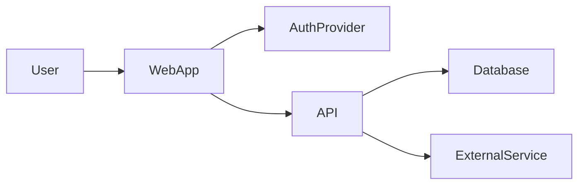

# Task: Create an AI-Optimized Project Overview and Handoff Documentation

You are acting as a senior software architect, technical writer, product analyst, and codebase investigator.

Your task is to inspect this repository and create a comprehensive, evidence-based overview of the project. The documentation will be handed to future AI agents so they can understand, analyze, improve, maintain, or port the application without repeatedly scanning the entire repository.

The project was developed using a specification-driven workflow. Prioritize existing specifications, architecture documents, task documents, decision records, and implementation plans before inspecting source code.

Do not modify application code unless explicitly instructed. Your output for this task must consist only of Markdown documentation files.

---

## Output Path
- use the path - `docs\project-overview` for all the output markdown files that this task will generate and output. Make sure to name the file a meaningful filename to easily spot what thsi markdown file is for.

---

# Primary Objectives

Create documentation that enables a future AI agent to:

1. Understand the purpose, users, business rules, workflows, and current state of the project.
2. Understand the technical architecture without scanning the entire repository.
3. Locate the exact files responsible for important features and behaviors.
4. Identify technical debt, architectural risks, inconsistencies, and improvement opportunities.
5. Understand how the current web application could be adapted into a mobile application.
6. Continue implementation work with minimal repository crawling and reduced token usage.
7. Distinguish confirmed facts from assumptions or inferred behavior.
8. Understand which existing specifications have already been implemented, partially implemented, or not implemented.

---

---
## Documents and files to check
This project is build using spec driven development and executed using matt pocock AI workflow skills
The specs, task, i write will also give you insight of the project including the main specs i written `AGENTS.md` and the markdown file inside the `docs`

- the `docs\specs` is the tasks for bigger module i usually used the matt poccock skill here to generate the PRD, issues and implement using TDD.
- the `docs\tasks` is the tasks for smaller module or bug fix that dont usually dont need a bigger tickets.
- the `docs\adr` is for the ADR related files generated by the coding agent.
- the markdown files in the root of the folder `/docs` is the supporting documents connected to my `AGENTS.md` file.
- 
---

# Core Rules

## 1. Do not scan the repository blindly

Use a progressive discovery strategy.

Start with:

* `README` files
* Project specifications
* Product requirement documents
* Architecture documents
* Feature specifications
* Implementation plans
* Task or ticket files
* Decision records
* Package manifests
* Environment variable examples
* Framework configuration
* Database schema and migrations
* API definitions
* Test configuration
* Deployment configuration

After reviewing those files, inspect source code only where necessary to confirm implementation details, resolve contradictions, or identify the files responsible for major features.

Do not read generated, vendored, cached, compiled, or irrelevant files unless required.

Normally exclude:

* `node_modules`
* `.next`
* `dist`
* `build`
* `coverage`
* `.git`
* Generated SDK files
* Lock files, except when dependency versions are relevant
* Minified files
* Binary assets
* Large fixture datasets
* Temporary files
* Cache directories

## 2. Be evidence-based

For every important technical claim, include supporting repository references.

Use this format:

```markdown
Evidence:
- `path/to/file.ts`
- `path/to/schema.sql`
- `path/to/spec.md`
```

When useful, mention exported functions, classes, components, database tables, routes, or configuration keys.

Do not paste large portions of source code. Summarize behavior and point to the responsible files.

## 3. Separate facts from inference

Use the following labels:

* **Confirmed** — directly supported by repository evidence.
* **Inferred** — strongly suggested by code or structure but not explicitly documented.
* **Unknown** — could not be determined from the repository.
* **Potentially outdated** — documentation conflicts with implementation or may no longer reflect the code.
* **Requires validation** — should be confirmed by the project owner or through runtime testing.

Never present an assumption as a confirmed fact.

## 4. Protect secrets and private data

Never include actual values for:

* API keys
* Database credentials
* Tokens
* Passwords
* Private URLs
* Service-role keys
* User data
* Personally identifiable information
* Production secrets

Document environment variable names, purpose, and whether they are required, but redact all secret values.

## 5. Optimize documentation for future AI agents

The resulting files must be concise enough to load selectively but detailed enough to avoid unnecessary repository scans.

Use:

* Clear headings
* Tables where appropriate
* Relative repository paths
* Cross-links between Markdown files
* Stable terminology
* Brief summaries before detailed sections
* Feature-to-file mappings
* Route-to-file mappings
* Database table mappings
* Explicit “read this next” guidance

Avoid:

* Repeating the same information in several files
* Large code dumps
* Generic software-development advice
* Describing framework concepts that are not specific to this project
* Guessing undocumented business rules
* Excessive narrative

---

# Required Output Location

Create the following directory:

```text
docs/ai-handoff/
```

Create the documentation files described below.

You may add another Markdown file when the project has a major domain that would make an existing file too large. However, keep the structure understandable and update the index whenever you add a file.

---

# Required Documentation Files

## 1. `docs/ai-handoff/README.md`

This is the main entry point for future AI agents.

It must contain:

* Project name
* One-paragraph project summary
* Documentation purpose
* Recommended reading order
* Document index
* Quick navigation by task
* Last analysis date
* Repository state or branch analyzed, when detectable
* Important limitations of the analysis
* Areas requiring owner confirmation

Include a task-based navigation table similar to:

| Future task            | Read these files first                           |
| ---------------------- | ------------------------------------------------ |
| Understand the product | `01-product-overview.md`, `02-user-workflows.md` |
| Fix a feature          | `04-feature-map.md`, `05-codebase-map.md`        |
| Change the database    | `07-data-architecture.md`                        |
| Review security        | `10-security-and-risks.md`                       |
| Build a mobile app     | `13-mobile-handoff.md`                           |
| Improve performance    | `11-quality-and-improvements.md`                 |

---

## 2. `docs/ai-handoff/01-product-overview.md`

Document the non-technical project context.

Include:

* Product purpose
* Problem being solved
* Target users
* User roles
* Primary use cases
* Main value proposition
* Business model, when discoverable
* Business rules
* Domain terminology
* Product boundaries
* Included capabilities
* Explicitly excluded capabilities
* Current product maturity
* Known constraints
* Success criteria or KPIs, when documented
* Open product questions

Create a glossary table:

| Term | Meaning | Evidence | Confidence |
| ---- | ------- | -------- | ---------- |

Do not invent product positioning that is not supported by repository evidence.

---

## 3. `docs/ai-handoff/02-user-workflows.md`

Describe the application's important end-to-end workflows.

For each workflow, include:

* Workflow name
* Actors
* Trigger
* Preconditions
* Main flow
* Alternative flows
* Validation rules
* Failure states
* Side effects
* Notifications
* Data created or updated
* Permissions involved
* Relevant UI routes
* Relevant API or server operations
* Database entities involved
* Source files
* Related specification
* Implementation status

Examples of workflows to look for:

* Registration
* Authentication
* Organization or workspace onboarding
* Invitation flow
* Record creation
* Approval workflows
* Booking or scheduling
* Payments
* Notifications
* File uploads
* Search and filtering
* Reporting
* Administrative workflows
* Account recovery
* Deletion or archival
* Subscription management

Only document workflows that actually exist or are clearly specified.

---

## 4. `docs/ai-handoff/03-specification-status.md`

Because this project uses specification-driven development, build a specification traceability report.

Identify all important:

* Requirements
* Specifications
* Plans
* Tickets
* Task lists
* Acceptance criteria
* Architecture decisions
* Feature documents

For each item, determine whether it is:

* Implemented
* Partially implemented
* Planned
* Deprecated
* Contradicted by implementation
* Unable to verify

Use a table:

| Spec or requirement | Source document | Implementation status | Implementation evidence | Missing parts | Notes |
| ------------------- | --------------- | --------------------- | ----------------------- | ------------- | ----- |

Also document:

* Specs without implementation
* Implemented features without an obvious specification
* Conflicting specifications
* Outdated plans
* Unresolved decisions
* Acceptance criteria that appear untested

---

## 5. `docs/ai-handoff/04-feature-map.md`

Create a feature inventory.

For each major feature, include:

| Feature | User roles | UI entry point | Core files | Server/API files | Database entities | External services | Status |
| ------- | ---------- | -------------- | ---------- | ---------------- | ----------------- | ----------------- | ------ |

For each major feature, add a concise explanation of:

* What the feature does
* Main business rules
* Authorization requirements
* Dependencies
* Known limitations
* Related tests
* Related specifications
* Important implementation notes

This file should help a future AI agent locate feature implementation without searching the entire repository.

---

## 6. `docs/ai-handoff/05-codebase-map.md`

Create a practical map of the repository.

Include:

* Top-level directory tree
* Purpose of each important directory
* Application entry points
* Routing structure
* Shared components
* Domain modules
* Service layer
* Data-access layer
* Server-side code
* API endpoints
* Hooks
* State management
* Utility modules
* Type definitions
* Validation schemas
* Middleware
* Background jobs
* Scripts
* Tests
* Database files
* Infrastructure and deployment files
* Generated files that should normally not be edited

Create a “Where to make changes” table:

| Change needed                   | Start here | Supporting files | Warnings |
| ------------------------------- | ---------- | ---------------- | -------- |
| Add a page                      |            |                  |          |
| Add an API operation            |            |                  |          |
| Change authentication           |            |                  |          |
| Add a database field            |            |                  |          |
| Add a user role                 |            |                  |          |
| Change validation               |            |                  |          |
| Add a notification              |            |                  |          |
| Add analytics                   |            |                  |          |
| Change deployment configuration |            |                  |          |

Include only rows that are relevant to the repository.

---

## 7. `docs/ai-handoff/06-technical-architecture.md`

Explain the technical architecture.

Include:

* Architecture style
* Frontend framework
* Backend model
* Rendering approach
* Client and server boundaries
* Data-fetching strategy
* State management
* Caching strategy
* Validation strategy
* Authentication
* Authorization
* Multi-tenancy, when applicable
* API architecture
* Database access
* File storage
* Background processing
* Real-time features
* External integrations
* Error handling
* Logging
* Analytics
* Deployment architecture
* Environment separation
* Testing architecture

Include a Mermaid architecture diagram when the architecture can be determined accurately.

Example:



The actual diagram must reflect this repository rather than the example.

Also include a “request lifecycle” explanation covering what happens from a user action through UI, validation, network request, authorization, persistence, cache invalidation, and UI update.

---

## 8. `docs/ai-handoff/07-data-architecture.md`

Document the data model.

Include:

* Database technology
* Schema organization
* Main tables or collections
* Primary keys
* Foreign keys
* Important relationships
* Enums
* Constraints
* Indexes
* Soft deletion
* Audit fields
* Tenant isolation
* Row-level security
* Triggers
* Stored procedures or database functions
* Migration strategy
* Seed data
* Data retention behavior
* Sensitive data
* Potential data-integrity issues

Create:

1. A table inventory.
2. A relationship summary.
3. A Mermaid ER diagram when practical.
4. A table-to-feature mapping.
5. A list of high-risk schema changes.
6. A migration checklist specific to this project.

Use repository paths for every schema or migration reference.

---

## 9. `docs/ai-handoff/08-api-and-integrations.md`

Document internal APIs and external integrations.

For internal APIs, include:

* Route or operation
* Method
* Purpose
* Authentication requirement
* Authorization requirement
* Request shape
* Response shape
* Validation
* Side effects
* Error behavior
* Calling features
* Implementation file

For external services, include:

* Service name
* Purpose
* Integration files
* Environment variable names
* Data sent
* Data received
* Webhooks
* Failure behavior
* Retry or idempotency behavior
* Security considerations
* Local-development requirements

Do not include secret values.

---

## 10. `docs/ai-handoff/09-frontend-and-ux.md`

Document the frontend and user experience.

Include:

* Route map
* Page inventory
* Layout structure
* Navigation
* Design system
* Shared UI components
* Forms
* Validation feedback
* Loading states
* Empty states
* Error states
* Responsive behavior
* Accessibility
* Internationalization
* Client-side state
* Server state
* Query keys and cache ownership
* Optimistic updates
* Lazy loading
* Pagination or infinite loading
* Role-based UI
* Known UX inconsistencies
* Areas that are tightly coupled to desktop or web behavior

Create a route table:

| Route | Purpose | Roles | Main component | Data dependencies | Mobile relevance |
| ----- | ------- | ----- | -------------- | ----------------- | ---------------- |

---

## 11. `docs/ai-handoff/10-security-and-risks.md`

Perform a repository-level security and risk review.

Inspect, where applicable:

* Authentication
* Authorization
* Row-level security
* Tenant isolation
* Input validation
* Output encoding
* Secret management
* Server/client boundary leaks
* Direct database access from clients
* File upload validation
* Webhook verification
* Payment idempotency
* Sensitive logging
* Personally identifiable information
* Rate limiting
* CSRF
* XSS
* SQL injection
* Insecure direct object references
* Dependency risks
* Error disclosure
* Account deletion
* Session handling
* Privileged administrative actions

Use this table:

| Risk | Severity | Confidence | Evidence | Impact | Recommended action |
| ---- | -------- | ---------- | -------- | ------ | ------------------ |

Severity values:

* Critical
* High
* Medium
* Low
* Informational

Do not claim that the application is secure merely because no issue was found during static inspection.

Clearly state that this is not a penetration test.

---

## 12. `docs/ai-handoff/11-quality-and-improvements.md`

Identify improvements across the project.

Group findings into:

* Product
* User experience
* Architecture
* Maintainability
* Performance
* Data fetching
* Caching
* Database usage
* Reliability
* Error handling
* Observability
* Security
* Testing
* Accessibility
* Developer experience
* Documentation
* Deployment

Use this table:

| ID | Improvement | Category | Impact | Effort | Priority | Evidence | Suggested approach |
| -- | ----------- | -------- | ------ | ------ | -------- | -------- | ------------------ |

Use:

* Impact: High, Medium, Low
* Effort: High, Medium, Low
* Priority: P0, P1, P2, P3

Prioritization meaning:

* **P0** — urgent correctness, security, or data-loss issue
* **P1** — important improvement with meaningful user or engineering impact
* **P2** — valuable but not urgent
* **P3** — optional refinement

Also include:

* Quick wins
* Structural improvements
* Risks of making changes
* Improvements that require product decisions
* Improvements that require runtime profiling
* Areas where implementation is already strong and should be preserved

Do not recommend changing technology solely because another technology is popular.

---

## 13. `docs/ai-handoff/12-testing-and-operations.md`

Document:

* Test frameworks
* Existing test categories
* Test locations
* Test commands
* Coverage configuration
* Features with tests
* Features without apparent tests
* Acceptance tests
* Integration tests
* End-to-end tests
* Database tests
* Security tests
* Mocking strategy
* Local setup
* Build commands
* Deployment process
* CI/CD
* Environment variables
* Monitoring
* Logging
* Error reporting
* Backup and recovery
* Rollback process
* Common operational risks

Create a “minimum verification checklist” that a future AI agent should run after changing the project.

Do not claim commands succeed unless you actually executed them.

When executing commands is permitted, record:

* Command
* Result
* Relevant error
* Whether the result appears environment-related or code-related

Do not fix errors during this documentation task unless explicitly requested.

---

## 14. `docs/ai-handoff/13-mobile-handoff.md`

Analyze how the existing web application can be adapted into a mobile application.

Do not simply recommend rewriting everything.

Document:

### Mobile product scope

* Features essential for the first mobile version
* Features that can remain web-only
* User roles that need mobile support
* Mobile-specific workflows
* Offline requirements
* Push notification requirements
* Camera, QR, location, biometrics, file, or media requirements
* App-store considerations
* Deep-linking needs

### Reusability assessment

Classify major parts of the existing project as:

* Directly reusable
* Reusable with extraction
* Reusable conceptually only
* Web-specific
* Must be rewritten
* Requires further investigation

Use a table:

| Existing area | Classification | Evidence | Mobile recommendation |
| ------------- | -------------- | -------- | --------------------- |

Assess:

* Types
* Validation schemas
* Business rules
* API client
* Data access
* Authentication
* Authorization
* Database
* Server actions
* UI components
* Hooks
* State management
* Query logic
* Caching
* Notifications
* File handling
* Analytics
* Tests

### Mobile architecture options

Compare realistic options based on the current stack, such as:

* Responsive web application or PWA
* Capacitor
* React Native
* Expo
* Native applications
* Shared monorepo

Only include options relevant to this repository.

For each option, discuss:

* Reusability
* Development effort
* Performance
* Native capability access
* Authentication impact
* Deployment impact
* Maintenance cost
* Risks
* Suitability for this project

Provide a recommended option, but label it as a recommendation rather than a confirmed requirement.

### Proposed mobile migration plan

Create a phased plan:

1. Preparation and decoupling
2. Shared contracts and business logic
3. API readiness
4. Authentication strategy
5. Mobile MVP
6. Native integrations
7. Testing
8. Release and monitoring

Include dependencies, risks, and acceptance criteria for every phase.

---

## 15. `docs/ai-handoff/14-ai-agent-context.md`

Create a compact context file specifically designed to be loaded into another AI agent's prompt.

This file must be much shorter than the full documentation.

It should contain:

* Project summary
* Main users
* Main workflows
* Technology stack
* Architecture summary
* Important business rules
* Authentication and authorization summary
* Main database entities
* Main routes
* Main feature modules
* Important external integrations
* Important repository paths
* Known risks
* Current priorities
* Mobile-readiness summary
* Important terminology
* Rules future agents must preserve
* Things that remain unknown

Target approximately 1,500–3,000 words unless the application is extremely small.

Do not duplicate every detail from the other files. Link to the detailed documentation.

Include this section near the top:

```markdown
## Instructions for Future AI Agents

1. Read this file before scanning source code.
2. Open only the linked domain document relevant to the current task.
3. Inspect source files only when the documentation does not answer the question or when implementation verification is required.
4. Treat repository code as the final source of truth when it conflicts with documentation.
5. Update the relevant handoff document after making material architectural or workflow changes.
```

---

## 16. `docs/ai-handoff/15-open-questions.md`

Collect unresolved matters.

Group them into:

* Product questions
* Business-rule questions
* Architecture questions
* Security questions
* Data questions
* Deployment questions
* Mobile questions
* Documentation conflicts
* Missing repository information

Use:

| Question | Why it matters | Evidence or conflict | Suggested owner |
| -------- | -------------- | -------------------- | --------------- |

Do not attempt to answer questions that the repository cannot support.

---

# Optional Documentation Splitting

When a required file becomes excessively long, split it by domain.

For example:

```text
docs/ai-handoff/features/
  authentication.md
  customers.md
  sales.md
  deliveries.md
  expenses.md
  notifications.md
```

or:

```text
docs/ai-handoff/data/
  core-schema.md
  authorization-and-rls.md
  migrations.md
```

When splitting files:

1. Keep the required parent file as a summary and index.
2. Link every child document from the parent.
3. Avoid duplicating full content.
4. Keep each child focused on one domain.
5. Update `README.md` and `14-ai-agent-context.md`.

---

# Repository Investigation Process

Follow these phases.

## Phase 1: Repository inventory

Identify:

* Repository type
* Languages
* Frameworks
* Package manager
* Workspace or monorepo structure
* Main applications
* Main packages
* Specification directories
* Documentation directories
* Database directories
* Infrastructure files
* Test directories

Produce an internal file-selection plan before reading implementation files.

## Phase 2: Specification-first analysis

Read all relevant specifications and summarize:

* Intended product behavior
* Features
* Business rules
* Acceptance criteria
* Planned architecture
* Known constraints
* Planned but incomplete work

Build an initial specification inventory.

## Phase 3: Configuration and architecture analysis

Inspect:

* Package manifests
* Framework configuration
* TypeScript or language configuration
* Environment templates
* Authentication configuration
* Database clients
* API configuration
* Query and caching configuration
* Deployment configuration
* Testing configuration

Use this to identify the real technology stack.

## Phase 4: Targeted implementation verification

Inspect only the source files needed to confirm:

* Routes
* Major features
* Workflows
* Data access
* Authentication
* Authorization
* Validation
* Database operations
* External integrations
* Error handling
* Tests

Use imports, route definitions, schemas, and symbol references to navigate rather than opening all files.

## Phase 5: Cross-check specifications against code

Identify:

* Implemented specifications
* Partial implementations
* Missing implementations
* Undocumented implementations
* Contradictions
* Deprecated functionality

## Phase 6: Risk and improvement assessment

Assess the implementation without changing it.

Prioritize concrete, repository-specific findings over generic recommendations.

## Phase 7: Mobile-readiness assessment

Determine which layers are reusable and where web-specific coupling exists.

## Phase 8: Documentation consistency review

Before finishing:

* Validate all file links.
* Remove duplicated sections.
* Confirm terminology is consistent.
* Confirm file paths exist.
* Confirm no secret values were included.
* Confirm facts and inferences are labeled.
* Confirm the compact AI context links to detailed files.
* Confirm every major feature has evidence.
* Confirm open questions are not disguised as facts.

---

# Context Loading Strategy for Future Agents

Design the output so another AI agent can use this sequence:

### Level 1: Minimal context

Read:

```text
docs/ai-handoff/14-ai-agent-context.md
```

### Level 2: Task-specific context

Read one or two relevant documents, such as:

```text
docs/ai-handoff/04-feature-map.md
docs/ai-handoff/07-data-architecture.md
```

### Level 3: Implementation verification

Inspect only the exact repository files referenced by the task-specific documentation.

The documentation should make this workflow practical.

---

# Required Final Report

After creating all documentation files, provide a concise completion report containing:

1. Files created.
2. Main technologies identified.
3. Number of specifications reviewed.
4. Number of major features identified.
5. Number of workflows documented.
6. Major risks discovered.
7. Highest-priority improvement opportunities.
8. Mobile strategy recommendation.
9. Important unknowns requiring owner confirmation.
10. Commands executed and whether they succeeded.
11. Files or directories intentionally excluded from analysis.
12. Any parts of the repository that could not be inspected.

Do not claim full repository coverage unless every relevant area was actually inspected.

---

# Quality Standard

The final documentation must allow a future AI agent to answer questions such as:

* What does this application do?
* Who uses it?
* What are its most important business rules?
* Where is a particular feature implemented?
* What database tables does a feature use?
* How does authentication and authorization work?
* What specifications are incomplete?
* Which files should be changed for a requested feature?
* What architectural risks exist?
* What should be improved first?
* Which logic can be reused in a mobile application?
* What must be extracted before creating a mobile version?
* Which documents should be loaded before examining source code?

When information is unavailable, write **Unknown** and add it to `15-open-questions.md`.

Begin by inventorying the repository and locating all specification and documentation files. Then perform the analysis and create the Markdown handoff package.
